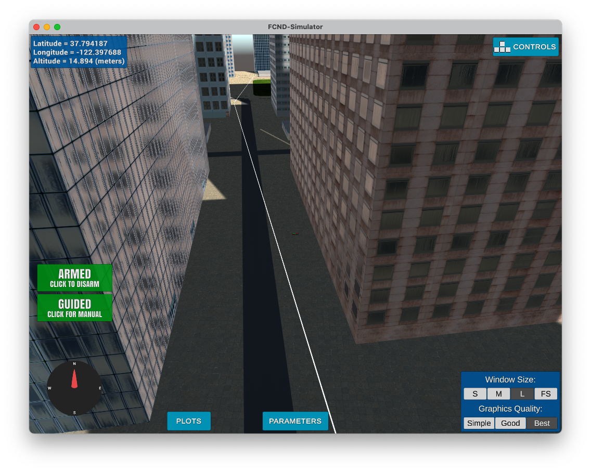
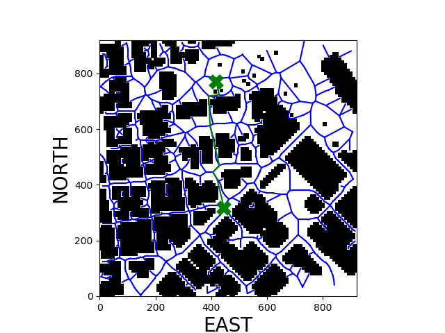
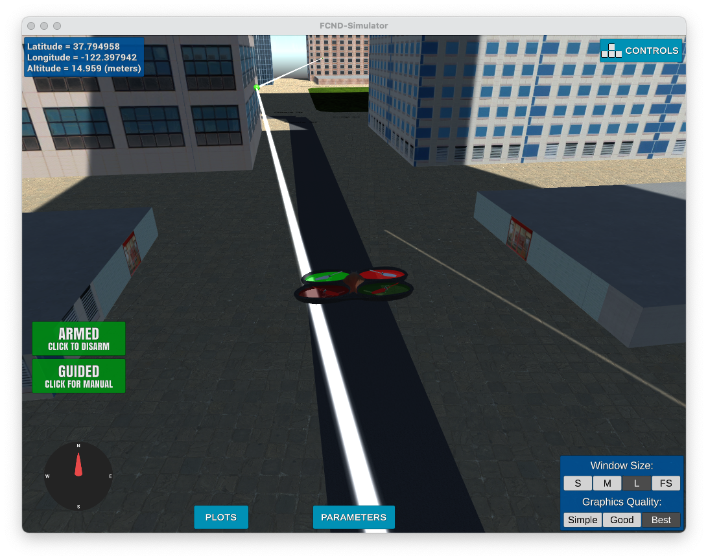
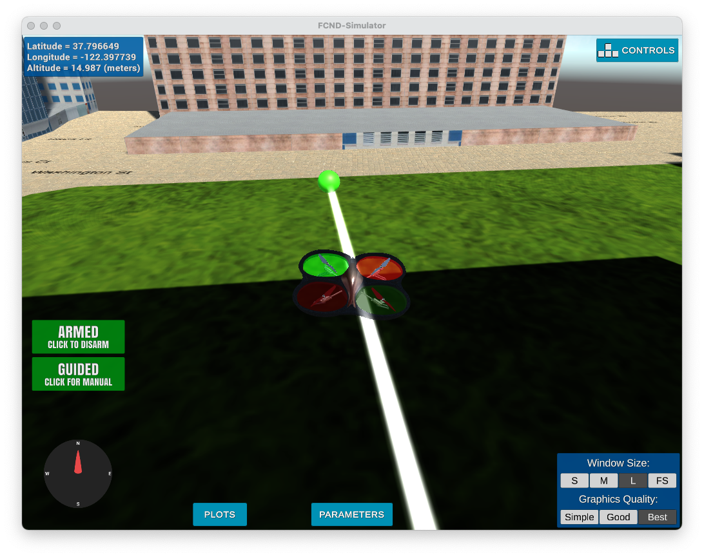
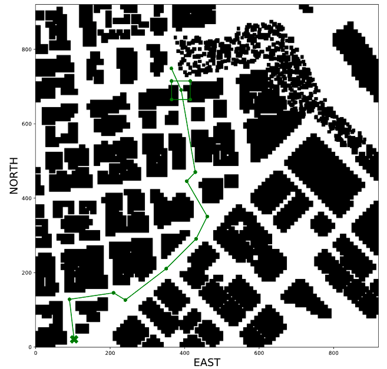
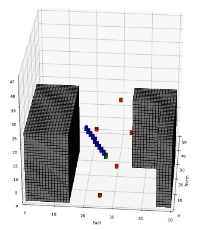

# FCND - 3D Motion Planning



This project implements path planning and drone control to navigate a vehicle through a simulated city in Udacity's Unity-based simulation environment. The Udacity simulator can be found at the following link: [simulator releases repository](https://github.com/udacity/FCND-Simulator-Releases/releases).

## Test setup
To run the test, open the simulator and run the following command:

```sh
python motion_planning.py
```
The quad will plan a course, take off, navigate the city, and land at the goal.

A simple version of a path planner is given in backyard_flyer_solution.py in which the quad is given four waypoints and then flies a path connecting those waypoints. In the motion_planner.py file, the waypoints are not given--instead a lat/lon for a goal is provided. The planner then does a search using the city data to find a safe path from the start point to the goal point. This path planning step is the primary difference between the two scripts.

## The Planner


### The planning algorithm follows the following main steps:

- Loads the 2.5D map in the `colliders.csv` file describing the environment.
- Discretizes the environment into a grid and then graph representation.
- Defines the start and goal locations. The home location is determined from `self._latitude` and `self._longitude`. 
- Performs a search using A* on the graph. 
- Use a collinearity test and Bresenham to remove unnecessary waypoints.
- Provides waypoints in local ECEF coordinates. The format for `self.all_waypoints` is [N, E, altitude, heading], where the drone’s start location corresponds to [0, 0, 0, 0]). 

### Functionality of key files

- `motion_planning.py` provides the overall framework for the callbacks used in the drone control. It starts by defining states and callbacks, arming the quad, planning a path, generating waypoints and flying the route.

- `planning_utils.py` provides the functionality for creating graphs and edges, evaluating edges for collisions, and conducting an A* search on the resulting graph.

- `pruning.py`  provides the algorithm for pruning a path generated with A* on the full graph. The pruning algorithm is iterative, in that it starts with a large epsilon value in the Bresenham calculation and continues to decrease the epsilon value until a hit occurs.

## Implementation of the Path Planning Algorithm

#### 1. Set global home position
The start position was set as the values given in the first line of the csv file: lat0 and lon0. These values were read and parsed with basic python tools. The self.set_home_position() method was then called to set the global home. 

#### 2. Set current local position
A local position was established by using the 'global_to_local()' function from the udacidrone library 'udacidrone.frame_utils'.
```python
local_position = global_to_local(global_position=self.global_position, global_home=self.global_home)
```

#### 3. Set grid start position from local position
In loading and evaluating the environment data from the .csv file, north and east offsets are defined to transition from a coordinate system based on the origin at the center of the image to one based on a lower left origin. Thus, the local position is transformed into a grid coordinate through the following:
```python
grid_start = (int(local_position[0]) - north_offset, int(local_position[1])-east_offset)
```

#### 4. Set grid goal position from geodetic coords
The goal, assumed to be given by latitude and longitude, is transformed into the grid frame in the same way outlined above. First, the global coordinates are transformed into local coordinates and then transformed into grid coordinates using the calculated offsets.

#### 5. Create graph and run A*
From the grid representation based on the obstacle data given in the `colliders.csv` file, a voronoi graph was generated. Edges were then evaluated for collisions with obstacles. The resulting graph was provided to an A* algorithm developed to find a path through the graph. 

#### 6. Prune waypoints 
The path was pruned iteratively. The primary tool was a collinearity check using a variable epsilon in evaluating the determinant, i.e., determinant < epsilon. Once a pruned path was generated, Bresenham was used to evaluate the new edges. If there were no collisions, the epsilon was reduced and the process repeated. This ultimately produced the maximally pruned path. 

The following shows the result of the search process. The obstacles were created from the .csv file, the blue structure through the city represents the Voronoi graph, and the green lines represent the pruned path. In this case, the original A* search produced a path 39 edges in length; the pruned path was only 8.




## Executing the flight
### Take-off to landing
The overall flow was successful in navigating buildings and reaching the goal. The following images show the quad in mid-flight and approaching the goal, along with the associated waypoints and trajectories.




## Additional Considerations
In addition to the simple graph-based A*, I also explored the receding horizon approach. Though it is not implemented above (it wasn't needed), I provided an overview in the 'receding_horizon' folder. 

This approach was similar to the above, but once the simple 2D A* path was defined, a 40x40 m high-resolution 3D voxel map was generated with current waypoint at the center. The local goal was determined by a line from the current waypoint to the next waypoint and its intersection with the local voxel volume. Then, using the local collision data and random sampling, a 'probabilistic roadmap' was used to create trajectories through the localized 3D space. This required modifications to the A*, collision, and Bresenham tools. The following images illustrate this process.


